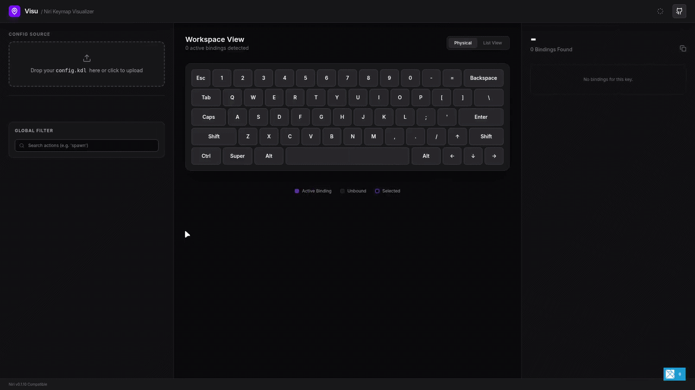

# Visu: Niri Keymap Visualizer

Visu is a tool for visualizing keyboard shortcuts for the
[niri](https://github.com/YaLTeR/niri) window manager. It parses your
`config.kdl` and displays an interactive keyboard layout to browse configured
bindings.

## Features

- **Interactive Layout**: Physical keyboard visualization with modifier highlighting.
- **Search**: Filter bindings by action or key name.
- **Binding Details**: View specific actions and configuration options (e.g. `hotkey-overlay-title`).
- **Views**: Toggle between physical keyboard and list view modes.
- **Parser**: Rust-based KDL parser compiled to WebAssembly.

## Getting Started

### Development

If you have Nix installed:

1. Clone the repository.
2. Run `nix develop`.
3. Run `just install`.
4. Run `just dev`.
5. In a separate terminal, run `just watch-rust`.

For manual setup, ensure you have Rust (wasm32 target), `wasm-pack`, Elm, Node.js, and `pnpm`.

### Commands

| Command | Description |
| :--- | :--- |
| `just install` | Install dependencies |
| `just dev` | Start development server |
| `just watch-rust` | Rebuild WASM on changes |
| `just build` | Production build |
| `just test` | Run tests |
| `just fmt` | Format source code |

## Project Structure

- `src/`: Elm source files.
- `parser/`: Rust parser source.
- `flake.nix`: Nix development environment.
- `justfile`: Project task definitions.

## Technical Stack

- **Frontend**: Elm
- **Parser**: Rust (WASM)
- **Styling**: Tailwind CSS
- **Build**: Vite
- **Tasks**: Just
- **Environment**: Nix (optional)
